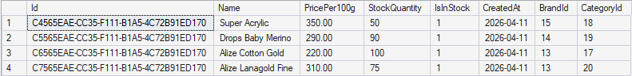
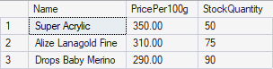
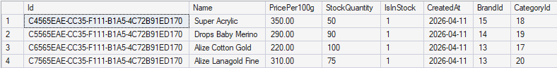
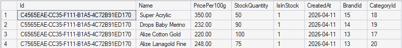
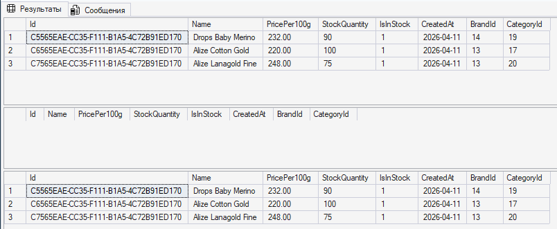
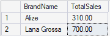
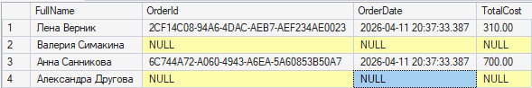
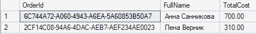
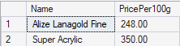

Запросы по созданию базы и таблиц лежат в соответствующих файлах (см. по названиям). Куча insert'ов - тестовые данные.

Запросы по заданию:
1. Выборка данных с фильтрацией, сортировкой.

-- Выборка пряжи дороже 250 рублей в продаже в порядке убывания.

SELECT Name, PricePer100g, StockQuantity
FROM Yarn
WHERE IsInStock=1 AND PricePer100g > 250.00
ORDER BY PricePer100g DESC

2.1. Изменение данных.

-- Скидка 20% на любую шерстяную пряжу (в наличии мериносовая и овечья).

UPDATE Yarn
SET PricePer100g = PricePer100g * 0.8
WHERE CategoryId IN (SELECT Id FROM Category WHERE TypeName LIKE '%Wool');

2.2. Удаление данных.

-- Удаление записей с ценником менее 250 рублей из таблицы Yarn.

-- Многочисленные select'ы нужны для проверки корректного удаления.
SELECT * FROM Yarn WHERE PricePer100g < 250.00;

BEGIN TRANSACTION;

-- Отключение ограничений в связанной таблице.
ALTER TABLE [OrderItem] NOCHECK CONSTRAINT [FK__OrderItem__YarnI__5EBF139D];

DELETE FROM Yarn WHERE PricePer100g < 250.00;

SELECT * FROM Yarn WHERE PricePer100g < 250.00;

-- Откат нужен затем, что записи мне еще пригодятся.
ROLLBACK TRANSACTION;

-- Включение ограничений.
ALTER TABLE [OrderItem] WITH CHECK CHECK CONSTRAINT ALL;

SELECT * FROM Yarn WHERE PricePer100g < 250.00;

3. Выборка с группировкой.

-- Выборка с группировкой по бренду (суммы продаж по брендам).

SELECT b.Name AS BrandName, SUM(oi.Quantity * oi.PriceAtPurchase) AS TotalSales
FROM OrderItem oi
JOIN Yarn y ON oi.YarnId = y.Id
JOIN Brand b ON y.BrandId = b.Id
GROUP BY b.Name;

4. Выборка из нескольких связанных таблиц (левое, правое соединение, пересечение).

4.1. Левое соединение.

-- Выборка всех покупателей с/без заказов.

SELECT c.FullName, o.Id AS OrderId, o.OrderDate, o.TotalCost
FROM Customer c
LEFT JOIN [Order] o ON c.Id = o.CustomerId;

4.2. Правое соединение через перестановку таблиц.

-- Все заказы и данные покупателей.

SELECT o.Id AS OrderId, c.FullName, o.TotalCost
FROM Customer c
RIGHT JOIN [Order] o ON c.Id = o.CustomerId;

4.3. Пересечение.

-- Пряжа, которую заказывали хоть раз.

SELECT DISTINCT y.Name, y.PricePer100g
FROM Yarn y
INNER JOIN OrderItem oi ON y.Id = oi.YarnId;

Примечание: insert для OrderItem составлен некорректно, для изменения данных воспользуйтесь запросом UpdateOrderItem.sql.
